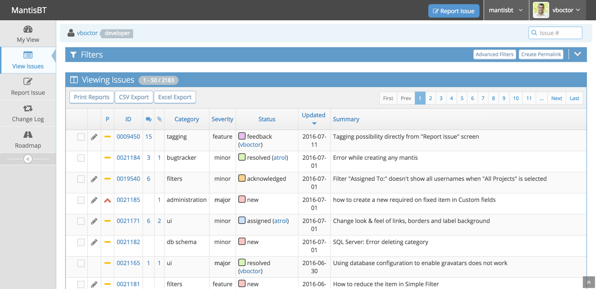
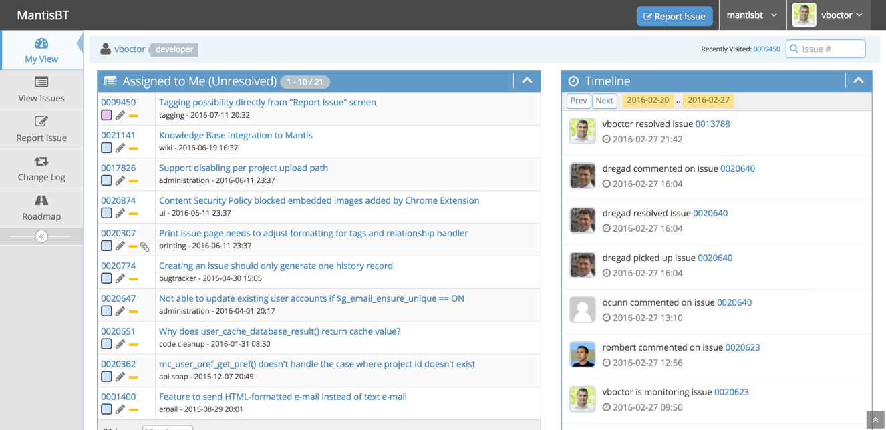
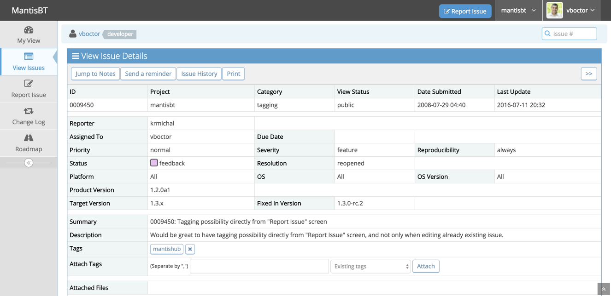

Doctis - Document Issue Tracking System
=======================================

About
-----

Doctis aims to add support for tracking documents and the issues raised against them during a review process.

Documents can be any set of electronic files or physical objects that can have configuration data to identify them.

The documents themselves will not be contained within the system, but rather their leading particulars will include a reference number, and/or a URL to their location.

The easiest way to try Doctis is to duplicate the developers test environment, hosted in a VirtualBox running Debian Linux.

A script to automatically clone, install, and configure Doctis is under development and currently in beta tesing.

Installing
----------

1. Install [] on any system which it is supported on.

2. Create a Debian Linux virtual machine using []
   a. select the VirtualBox default automated install option (results in a GNOME* desktop environment)
   b. upon initial login, open a terminal window (click top-left corner and then the black terminal icon)
   c. enable sudo: (where <username> is your login username)
         $ su -
         $ usermod -aG sudo <username>
         $ shutdown
      (a system restart seems to be required machine to ensure sudo is enabled)
   d. create a clone (backup) of this virtual machine as a reference baseline (recommended)
   e. restart the virtual machine
   f. make a working directory, or just use the existing '~/Documents' directory
         $ cd Documents
   g. copy the provided script text into a file of your choosing, ie. install.sh
      (the script text is BETWEEN the ~~~~~~~~~...~~~~~~~~~ lines as per below)
   h. enable the executable property on the script and run it:
         $ chmod +x install.sh
         $ ./install.sh

3. Follow the getting-started tips which should eventually be displayed.
    
NOTE: in order to create new users in mantisbt/doctis, the ability to send smtp emails is required and perhap the most-difficult way to achieve this is to create an App Password for a gmail account. However the system can still be used in single administrator mode without being able to send email. The default account is 'administrator' with password 'root'.

*for alternative desktop environments, perform a manual Debian setup process. (this has not been tested)

Doctis Install Script
---------------------

WARNING: this script should only be used inside your Debian Linux virtual machine.

~~~~~~~~~~~~~~~~~~~~~~~~~~~~~~~~~~~~~~~~~~~~~~~~...~~~~~~~~~~~~~~~~~~~~~~~~~~~~~~~~~~~~~~~~~~~~~~~~~
#!/bin/bash

# Customise the email settings and database credentials for the installer to use
email_addr="my.email@gmail.com"
email_hash="GmailAppPassword"
mysql_pass="password"

# Do we want a local machine only server (localhost)
# or one available to a local network (via server ip address)
# or using a Fully Qualified Domain Name (FQDN) aka: url for hosting on the internet - *advanced users only*
#domain="locahost"
domain=$(ip -4 addr show dev "$(ip route show default | awk '{print $5}' | head -n1)" | awk '/inet / {print $2}' | cut -d/ -f1)
#domain="mydomain.com"

# Fetch the installer and run
wget https://gist.githubusercontent.com/Inspirati/8f17b0799fdaf0ab7b201a5cfd1775a1/raw/3ddc1099af4c9331ed9e214847d9adf8208152c0/install-doctis.sh
chmod +x install-doctis.sh
./install-doctis.sh ${domain} ${mysql_pass} ${email_addr} ${email_hash} | tee logfile.txt
~~~~~~~~~~~~~~~~~~~~~~~~~~~~~~~~~~~~~~~~~~~~~~~~...~~~~~~~~~~~~~~~~~~~~~~~~~~~~~~~~~~~~~~~~~~~~~~~~~

Feedback
--------

Should the installation fail please raise an issue and attach a copy of the generated logfile.txt

Limitations
-----------

Their is currently no built-in user interface support for adding documents to the database. Document data needs to be added to the database directly using other tools, such as phpMyAdmin or the CLI.

Origins
-------

The following is verbatim from the mantisbt GitHub repository at the time of forking and as such the instructions may not be applicable to Doctis.

Mantis Bug Tracker (MantisBT)
=============================

Screenshots
-----------

Documentation
-------------

For complete documentation, please read the administration guide included with
this release in the `doc/<lang>` directory.  The guide is available in text, PDF,
and HTML formats.

Requirements
------------

* MySQL 5.5.35+, PostgreSQL 9.2+, or other supported database
* PHP 7.4.0+
* a webserver (e.g. Apache or IIS)

Please refer to section 2.2 in the administration guide for further details.

Installation
------------

* Extract the tarball into a location readable by your web server
* Open your browser and navigate to `https://example.com/mantisbt/admin/check/index.php` to verify
  that your web server is compatible with MantisBT and configured correctly.
* Open your browser and navigate to `https://example.com/mantisbt/admin/install.php` to start the
  database installation process.
* Select the database type and enter the credentials to access the database
* Click install/upgrade
* Installation is complete -- you may need to copy the default configuration
  to `mantisbt/config/config_inc.php` if your web server does not have write access
* Remove the `admin` directory from within the MantisBT installation path. The
  scripts within this directory should not be accessible on a live MantisBT
  site or on any installation that is accessible via the Internet.

UPGRADING
---------

* Backup your existing installation and database -- really!
* Extract the tarball into a clean directory; do not extract into an existing
  installation, as some files have been moved or deleted between releases
* Copy your configuration from the old installation to the new directory,
  including `config_inc.php`, `custom_strings_inc.php`, `custom_relationships_inc.php`,
  `custom_functions_inc.php` and `custom_constants_inc.php` if they exist
* Point your browser to `https://example.com/mantisbt/admin/check/index.php` to ensure that
  your webserver is compatible with MantisBT and configured correctly
* Point your browser to `https://example.com/mantisbt/admin/install.php` to upgrade
  the database schema
* Click install/upgrade
* Remove the `admin` directory from within the MantisBT installation path. The
  scripts within this directory should not be accessible on a live MantisBT
  site or on any installation that is accessible via the Internet.
* Upgrading is complete

CONFIGURATION
-------------

This file contains information to help you customize MantisBT.  A more
detailed doc can be found at https://www.mantisbt.org/docs/

* `config_defaults_inc.php`
  * this file contains the default values for all the site-wide variables.
* `config/config_inc.php`
  * You should use this file to change config variable values.  Your
    values from this file will be used instead of the defaults.  This file
    will not be overwritten when you upgrade, but config_defaults_inc.php will.
    Look at `config/config_inc.php.sample` for an example.

* `core/*_api.php` - these files contains all the API library functions.

* global variables are prefixed by `g_`
* parameters in functions are prefixed with `p_` -- parameters shouldn't be modified within the function.
* form variables are prefixed with `f_`
* variables that have been cleaned for db insertiong are prefixed with `c_`
* temporary variables are prefixed with `t_`.
* count variables have the word `count` in the variable name

More detail can be seen in the coding guidelines at:
https://www.mantisbt.org/guidelines.php

* The files are split into three basic categories, viewable pages,
  include files and pure scripts. Examining the viewable pages (suffix `_page`)
  should make the basic file format fairly easy to see.  The file names
  themselves should make their purpose apparent.  The approach used is to break the
  work into many small files rather than have a small number of really
  large files.

* You can set `$g_top_include_page` and `$g_bottom_include_page`
  to alter what should be visible at the top and bottom of each page.

* All files were edited with TAB SPACES set to 4.
